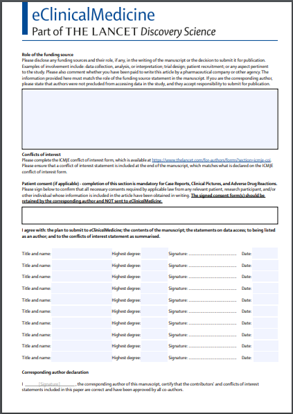

There is so much infuriating nonsense in the world of academic admin.

One bit of nonsense is **grant admin**.

Today, I filled out an online form for a major grant application. 

It was a simple task: list 6 papers and 2 grants that I've been involved in.  It took me about an hour, over a period of three days, and involved an email thread between 8 people, several screenshots, and utter despair masquerading as jokes. We solved one problem by agreeing to edit "as quickly as possible", because everything went wrong when we were all logged in at the same time.

This is normal. _Every single_ grant application process is terrible. The rule seems to be that the larger the funder, the more terrible the software is.  Today we were applying to a national institute with an annual spend of well over £1 billion, so that means it was the software equivalent of that Willy Wonka Experience [from the news](https://www.bbc.co.uk/news/uk-scotland-glasgow-west-68431728). 

Another kind of admin that makes academics despair is the **journal admin**.

Whenever a paper is accepted for publication, each author has to do two very important and perfectly reasonable things: describe any potential conflicts of interest they may have; and sign some terms of agreement.

What's _amazingly_ frustrating is that the main way of doing this is by spraying email attachments everywhere, one per author, as a PDF or a Word document.

To take a random example, here's the blank terms of agreement for a [paper I was involved in last year](https://www.thelancet.com/journals/eclinm/article/PIIS2589-5370(23)00241-9/fulltext). 

Imagine being me, having to remember out how to open a PDF in a way that allows me to edit it, and "sign" it. 

(And come to think of it, what does "sign" even mean? Does it just need a picture of signature? Does it need to be digitally, cryptographically signed? Can I just type my name? Nobody knows.)

Now imagine being Ya-Ting, the lead author, who had to get _14 other authors_ to "sign" this, by emailing and then chasing every one of them. That's one "blank form" attachment to send to each author (prefilled with the paper's title); several reminder emails (you can bet some of them *cough* are going to take 3 or 4 nudges); then 14 PDF attachments back, each individually signed.

Authors have slowly evolved a tacit agreement that no-one is going to bother getting _all the authors to sign one document_, so now imagine being someone at the journal and receiving 15 copies of this file as an attachment somewhere and doing some other kind of hellish admin with them. 

Then there's disclosures, in the malevolent form of the omnipresent [ICMJE form](https://www.icmje.org/about-icmje/faqs/conflict-of-interest-disclosure-forms/).  (I don't know why I hate it so much, but I really do.) This is a Word document which doesn't even have the dignity of a little box for whatever your signature is supposed to be. The process of "signing" it is literally to press the letter `X` in one place in the Word document. And sending it back as an attachment. 

This is a process used by every medical journal in the world (as far as I know). Exactly the same Word document, with a couple of `X`s in it (maybe some conflicts of interest, if you're lucky), repeated once for every author. 

None of these ever see the light of day again, as far as I can tell. Maybe there's a whole department at the publisher allocated to waste some more time by, I don't know, making oompah loompahs write it all out in copperplate and turning it into jigsaw puzzles. (Incidentally, authors are expected to write conflicts of interest _in the actual paper where people can actually read them_ in any case.)

I feel _so sad_ about all that wasted time for something which could _so easily_ be designed with _users_ in mind. So very sad, I've started writing some software in a kind of angry protest. The entire thing is such a harmful, time-wasting charade, it's driven me to spite-based-programming: I'm going to invest a totally unnecessary amount of effort into this, as a kind of performance art scream into the void.

With that, I present [_Fending-off Academic Form Fuss_ (FAFF)](https://github.com/sebbacon/FAFF): a very rough, first run at automating filling out all these immensely irritating forms with a Python script.

I doubt many other people will actually use it; right now it's very limited, in any case. But *I've* already used it twice and it has given me a small thrill of righteousness each time. The user experience is simply: 

1. Edit a file that lists your name, conflicts of interest, etc
2. Run a command

In my dreams, this software will evolve to become a repository of every conflict of interest of every academic. It'd save everyone's time, and make for better science, all in one go.

I secretly hope the journals never sort out a better system, so that this dream software can maliciously comply with journal admin by spraying attachments at journals on behalf of a host of joyful academics, finally liberated to spend time on things like writing angry blog posts about journal admin.

In reality, it will probably remain a small, sad collection of scripts I wrote in an angry moment which I never use again, but I don't really mind.